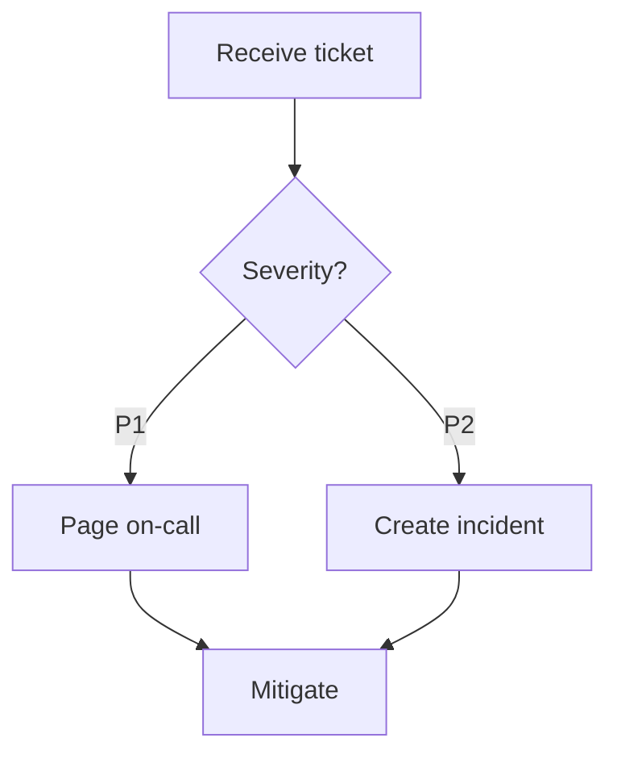
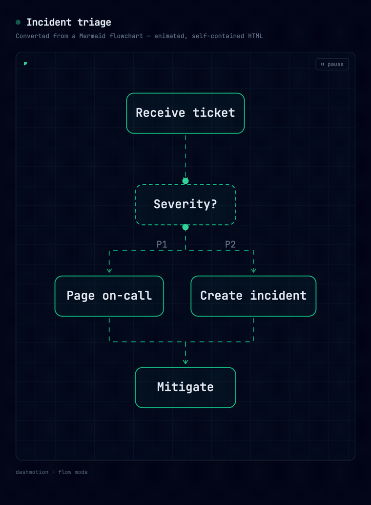

# Dashmotion

English | [简体中文](README.zh-CN.md)

**Diagrams that move.** A Claude AI skill that turns a plain-English description — or a Mermaid source — into an animated technical diagram: a self-contained HTML/SVG file where dashed connectors stream in the direction of execution and light dots travel through the system like requests in flight. The style you see on modern infra landing pages (Diagrid, Temporal, Inngest).

| Flow mode | Architecture mode |
|---|---|
|  |  |

## What it does

Describe a workflow or a system — in plain English, or paste a Mermaid diagram — and Claude hands back a single `.html` file that's already moving. The name is the implementation: `stroke-dashoffset` offset animation + `animateMotion` paths — no libraries, no GIF rendering, no design tools.

- **Inputs (today):** a natural-language description, or a Mermaid `flowchart` / `graph` / `stateDiagram-v2` source — the same animated result either way.
- **Output styles (today):** **Flow** — workflows, pipelines and state machines, where execution visibly streams from START to END through branches and merges; and **Architecture** — systems and topology, with semantic component colors, region/security boundaries, a legend, and the differentiator: animated request journeys, a dot hopping client → gateway → service → database and back.
- **Refine in plain language:** *"make the auth path stand out"*, *"put Redis next to Postgres"*, *"split the workers into a second diagram."*
- **The output is dependency-free:** one HTML file — vector, loops forever, a few KB, opens in any browser.

## Install

Needs a Claude plan that includes skills (Pro, Max, Team, or Enterprise).

**Claude Code** — one command. `-g` installs it globally (every project sees it); drop `-g` to install into the current project only (`./.claude/skills/`):

```bash
npx skills add csthink/dashmotion -a claude-code -g
```

<details>
<summary>Why <code>-a claude-code</code>, and global vs. project?</summary>

- **`-a claude-code`** writes a plain *copy* (into `~/.claude/skills/` with `-g`, or `./.claude/skills/` without). The bare `npx skills add csthink/dashmotion` makes a *symlink* instead, and Claude Code's symlink handling is rough — the link may not get created, a symlinked skill doesn't appear in `/skills` ([claude-code#14836](https://github.com/anthropics/claude-code/issues/14836)), and `npx skills update` won't refresh it. A copy lists in `/skills` and updates cleanly. If the CLI ever prompts copy-vs-symlink, choose **copy** (or pass `--copy`). Other agents (Cursor, Codex, …) read `~/.agents/skills/` directly and work fine with the bare command.
- **Global (`-g`)** lives in `~/.claude/skills/`, available everywhere. **Project-local** (no `-g`) lives in `./.claude/skills/` — scoped to that one directory, and handy to commit alongside a repo so your team gets the skill.

Prefer the zip on Claude Code? `rm -rf ~/.claude/skills/dashmotion && unzip dashmotion.zip -d ~/.claude/skills/` — clear the folder first when upgrading so old files don't linger.
</details>

**claude.ai** — download `dashmotion.zip` from [Releases](../../releases), then **Settings → Capabilities → Skills → + Add → upload → toggle on**.

### Upgrading

No Claude client tells you when a skill has a new version — you pull updates yourself. On **Claude Code**, one command refreshes it in place:

```bash
npx skills update -g -y          # scope it to one skill: npx skills update dashmotion -g -y
```

Drop `-g` for a project-local install; re-running the install command works too. On **claude.ai** there's no in-place update — delete the old skill and upload the new `dashmotion.zip`.

**Check which version you're on** — it lives in the skill's `SKILL.md`; compare it against the latest [release](../../releases) (`npx skills list` shows the path, not the version):

```bash
grep '^version:' ~/.claude/skills/dashmotion/SKILL.md     # project-local: ./.claude/skills/dashmotion/SKILL.md
```

<details>
<summary>Hands-off: auto-update on every session (Claude Code)</summary>

Add a `SessionStart` hook so Claude Code refreshes the skill each time it starts. In `~/.claude/settings.json`:

```json
{
  "hooks": {
    "SessionStart": [
      { "matcher": "startup", "hooks": [
        { "type": "command", "command": "npx skills update dashmotion -g -y >/dev/null 2>&1 || true" }
      ] }
    ]
  }
}
```

It costs a short network call at startup and silently keeps you on the latest tag. Widen the command to `npx skills update -g -y` to auto-update *all* your global skills.
</details>

**Uninstall:**

```bash
npx skills remove dashmotion -g         # installed via the skills CLI (drop -g if project-local)
rm -rf ~/.claude/skills/dashmotion      # installed by unzipping (use ./.claude/... for project-local)
```

## Quick start

Then just ask. These two prompts generated the demos at the top — paste either to reproduce it:

**Flow** — the left demo:

```
Use dashmotion to visualize our CI/CD pipeline: a commit runs lint, unit tests and integration tests in parallel; all three merge into building a Docker image; then a security scan; then a deploy to staging; then a manual approval gate — approved deploys to production and posts a Slack notification, rejected notifies the author and ends.
```

**Architecture** — the right demo:

```
Use dashmotion to draw our Kubernetes microservices platform and animate the main request path: an NGINX ingress in front; users, catalog, cart and payments services in the 'shop' namespace; a Kafka bus between the services and two async workers (email worker, analytics worker); PostgreSQL for orders and MongoDB for the catalog; Prometheus and Grafana in an observability namespace. Animate a checkout request from ingress through cart and payments to PostgreSQL, plus an async event from payments through Kafka to the email worker.
```

**A few things worth knowing:**

- Each generation lays things out a little differently — yours won't be pixel-identical to the demo, but it's the same diagram.
- You don't have to spell everything out: point it at a design doc (*"use dashmotion to draw the architecture in `docs/design.md`"*) or just ask for a flowchart / architecture diagram of what you're building.
- Already have the diagram as Mermaid? Paste it — see [Mermaid input](#mermaid-input) below.
- Don't like the result? Say so in plain language and it refines from there.

## Mermaid input

Already have the diagram as Mermaid? Paste it — dashmotion turns a static `flowchart`/`graph` or `stateDiagram-v2` source into the same **moving** diagram, no redrawing. Topology and labels are kept exactly; only the layout and colors are recomputed.

````
Use dashmotion to animate this mermaid diagram:


````

…becomes a moving flowchart — dashed connectors stream from `Receive ticket` through the `Severity?` decision, fan out, and merge into `Mitigate`, with a dot riding the path:



What to expect:

- **Preserved exactly**: every node and label, every edge and edge label, subgraph containment, and edge kinds — `-->` animates, `-.->` becomes a dotted async edge, `==>` marks the main path and gets the traveling dot.
- **Recomputed by design**: layout (always top-down — `LR` sources are re-laid out; structure is preserved, geometry is not) and colors (`classDef`/`style`/`linkStyle` are replaced by dashmotion's semantic palette).
- Subgraphs that name system components (namespaces, VPCs, tiers) route to architecture mode with boundaries and request journeys; plain process subgraphs stay in flow mode.
- Other mermaid types (sequence, class, ER, gantt) aren't supported — dashmotion says so instead of guessing a lossy conversion.

## Why not just a GIF?

| | GIF | Dashmotion (SVG/CSS) |
|---|---|---|
| File size | MBs | KBs |
| Sharpness | fixed resolution | vector, infinite zoom |
| Editable | re-render everything | ask Claude to change one box |
| Loop | frame-perfect work | free |
| Convert to GIF later | — | one command (`timecut`) or screen-record |

## Accessibility

All CSS animation is gated behind `@media (prefers-reduced-motion: no-preference)`; SMIL dots are removed by script under reduced motion; every diagram ships a visible pause/play toggle and `role="img"` + `<title>`/`<desc>`.

## FAQ

**Can I install this alongside [architecture-diagram-generator](https://github.com/Cocoon-AI/architecture-diagram-generator)?**
Yes — tested side by side. Animation intent ("make the request path move") routes to dashmotion; plain static architecture requests stay with Cocoon's skill. No file conflicts.

## How it works, and more

The animation technique, the deterministic layout engine, the repo layout, and exporting to GIF/MP4 are in **[docs/how-it-works.md](docs/how-it-works.md)**. Version history is in **[CHANGELOG.md](CHANGELOG.md)**.

## Credits

Skill packaging pattern and the static architecture design system build on [Cocoon-AI/architecture-diagram-generator](https://github.com/Cocoon-AI/architecture-diagram-generator) (MIT). Visual style inspired by the workflow animations on [diagrid.io](https://www.diagrid.io/catalyst).

## License

MIT
