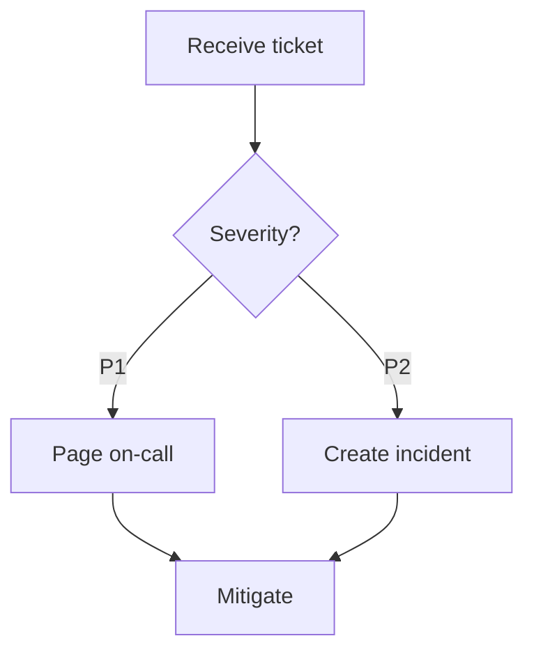

# Dashmotion

English | [简体中文](README.zh-CN.md)

**Diagrams that move.** A Claude AI skill that generates animated technical diagrams as self-contained HTML/SVG files — dashed connectors stream in the direction of execution, and light dots travel through the system like requests in flight. The style you see on modern infra landing pages (Diagrid, Temporal, Inngest), generated from a plain-English description.

The name is the implementation: **`stroke-dash`** offset animation + **`animateMotion`** paths. That's the whole trick — no libraries, no GIF rendering, no design tools.

| Flow mode | Architecture mode |
|---|---|
|  |  |

## Two modes

**Flow mode** — workflows, pipelines, state machines. *What happens, in what order.* Monochrome circuitry aesthetic: a dark canvas where execution visibly flows from START to END through branches and merges.

**Architecture mode** — systems, infrastructure, topology. *What the system is made of — and how requests move through it.* Semantic component colors (frontend/service/data/cloud/security), region and security-group boundaries, a legend, summary cards — plus the differentiator: animated request journeys. A cyan dot leaves the client, hops through the CDN and gateway, lands in a service, reaches the database, and a new request begins. Your architecture diagram explains *behavior*, not just structure.

## Quick start

Install the skill, then ask Claude for a diagram. Needs a Claude plan that includes skills (Pro, Max, Team, or Enterprise).

**Claude Code** — one command, installs or updates in place:

```bash
npx skills add csthink/dashmotion -a claude-code
```

<details>
<summary>Why the <code>-a claude-code</code> flag?</summary>

The bare `npx skills add csthink/dashmotion` *symlinks* the skill, and Claude Code's symlink handling is currently rough — the link may not get created, a symlinked skill doesn't appear in `/skills` ([claude-code#14836](https://github.com/anthropics/claude-code/issues/14836)), and `npx skills update` won't refresh it. `-a claude-code` writes a plain copy that `/skills` lists and that overwrites an older copy in place. Other agents (Cursor, Codex, …) read `~/.agents/skills/` directly and work fine with the bare command.

Prefer the zip on Claude Code? `rm -rf ~/.claude/skills/dashmotion && unzip dashmotion.zip -d ~/.claude/skills/` — clear the folder first when upgrading so old files don't linger.
</details>

**claude.ai** — download `dashmotion.zip` from [Releases](../../releases), then **Settings → Capabilities → Skills → + Add → upload → toggle on**.

Then ask. These two prompts generated the demos at the top — paste either to reproduce it:

**Flow mode** — the left demo above:

```
Use dashmotion to visualize our CI/CD pipeline: a commit runs lint, unit tests and integration tests in parallel; all three merge into building a Docker image; then a security scan; then a deploy to staging; then a manual approval gate — approved deploys to production and posts a Slack notification, rejected notifies the author and ends.
```

**Architecture mode** — the right demo above:

```
Use dashmotion to draw our Kubernetes microservices platform and animate the main request path: an NGINX ingress in front; users, catalog, cart and payments services in the 'shop' namespace; a Kafka bus between the services and two async workers (email worker, analytics worker); PostgreSQL for orders and MongoDB for the catalog; Prometheus and Grafana in an observability namespace. Animate a checkout request from ingress through cart and payments to PostgreSQL, plus an async event from payments through Kafka to the email worker.
```

Claude returns a single `.html` file. Open it — it's already moving.

**A few things worth knowing:**
- Each generation lays things out a little differently — yours won't be pixel-identical to the demo above, but it's the same diagram.
- In a real project you don't have to spell everything out: point it at a design doc (*"use dashmotion to draw the architecture in `docs/design.md`"*) or just ask for a flowchart / architecture diagram of what you're building — both work.
- Don't like the result? Say so in plain language — *"make the auth path stand out"*, *"put Redis next to Postgres"*, *"split the workers into a second diagram"* — and it refines from there.

## Mermaid input

Already have the diagram as Mermaid? Paste it — dashmotion converts `flowchart`/`graph` and `stateDiagram-v2` sources into the same animated diagrams:

````
Use dashmotion to animate this mermaid diagram:


````

What to expect:

- **Preserved exactly**: every node and label, every edge and edge label, subgraph containment, and edge kinds — `-->` animates, `-.->` becomes a dotted async edge, `==>` marks the main path and gets the traveling dot.
- **Recomputed by design**: layout (always top-down — `LR` sources are re-laid out; structure is preserved, geometry is not) and colors (`classDef`/`style`/`linkStyle` are replaced by dashmotion's semantic palette).
- Subgraphs that name system components (namespaces, VPCs, tiers) route to architecture mode with boundaries and request journeys; plain process subgraphs stay in flow mode.
- Other mermaid types (sequence, class, ER, gantt) aren't supported — dashmotion says so instead of guessing a lossy conversion.

## Why not just a GIF?

| | GIF | Dashmotion (SVG/CSS) |
|---|---|---|
| File size | MBs | KBs |
| Sharpness | fixed resolution | vector, infinite zoom |
| Editable | re-render everything | ask Claude to change one box |
| Loop | frame-perfect work | free |
| Convert to GIF later | — | one command (`timecut`) or screen-record |

## How the animation works

**Flowing dashes** — animate `stroke-dashoffset` by exactly one dash period:

```css
.flow { stroke-dasharray: 5 5; animation: dashmove 0.75s linear infinite; }
@keyframes dashmove { to { stroke-dashoffset: -10; } }
```

**Traveling dots** — `<animateMotion>` reusing the connector's own path data. In architecture mode, dots chain via SMIL event timing (`begin="j1.end+0.3s"`) so one request visibly hops tier by tier:

```svg
<circle r="3.5" fill="#22d3ee">
  <animateMotion id="j2" dur="0.7s" begin="j1.end+0.3s" fill="freeze"
    path="M416 118 L464 118"/>
</circle>
```

The skill encodes the layout arithmetic that makes generation reliable: branch-bar fan-out/fan-in, boundary nesting and padding rules, opaque masking under semi-transparent fills, legend placement, seamless-loop constraints, and z-ordering so dots vanish *into* the node they arrive at. Before delivering, it re-verifies the produced SVG against a structural checklist — overlapping boxes, connectors cutting through nodes, broken animation loops, out-of-viewBox coordinates — and fixes what it finds.

## Project layout

```
dashmotion/                               # repo root
├── skills/dashmotion/                    # the skill — this is what installs
│   ├── SKILL.md                          # Mode routing + animation contracts + shared tokens
│   ├── references/
│   │   ├── flow-mode.md                  # Flowchart layout arithmetic
│   │   ├── architecture-mode.md          # Semantic palette, boundaries, legend, request journeys
│   │   └── mermaid-input.md              # Mermaid → dashmotion conversion rules + fidelity contract
│   └── resources/
│       ├── template-flow.html            # Working flow example
│       └── template-architecture.html    # Working architecture example (AWS, animated request)
├── eval/                                 # structural-check harness + before/after evidence
└── examples/                             # demo GIFs
```

`npx skills add` and the release zip ship only `skills/dashmotion/`; `eval/` and `examples/` stay in the repo. Both templates are complete working examples — open them in a browser right now.

## Updating & uninstalling

**Update** — re-run the install: `npx skills add csthink/dashmotion -a claude-code` (it overwrites in place). On claude.ai, delete the old skill and upload the new zip.

**Uninstall:**

```bash
npx skills remove dashmotion            # installed via the skills CLI (add -g if global)
rm -rf ~/.claude/skills/dashmotion      # installed by unzipping (use ./.claude/... for project-local)
```

## Exporting to GIF / MP4

Screen-record the open file (macOS ⌘⇧5). Animation durations divide 3s evenly, so a 3-second capture loops seamlessly. For any diagram with traveling dots this is the reliable path — see the note below.

Headless / scriptable:

```bash
npx timecut your-diagram.html --viewport=1200,900 --duration=3 --fps=30 --output=out.mp4
ffmpeg -i out.mp4 out.gif
```

> **`timecut` + traveling dots:** the `<animateMotion>` dots run on SVG's SMIL timeline, which `timecut`'s virtual clock doesn't advance — a delayed-start dot stays parked at the SVG origin and leaves a stray mark in the top-left corner of every frame. `timecut` is fine for the dashed-connector flow; for the dots, screen-record in real time or drive a real-time headless screencast (e.g. Chrome DevTools `Page.startScreencast`) instead.

## Accessibility

All CSS animation is gated behind `@media (prefers-reduced-motion: no-preference)`; SMIL dots are removed by script under reduced motion; every diagram ships a visible pause/play toggle and `role="img"` + `<title>`/`<desc>`.

## FAQ

**Can I install this alongside [architecture-diagram-generator](https://github.com/Cocoon-AI/architecture-diagram-generator)?**
Yes — tested side by side. Animation intent ("make the request path move") routes to dashmotion; plain static architecture requests stay with Cocoon's skill. No file conflicts.

## Credits

Skill packaging pattern and the static architecture design system build on [Cocoon-AI/architecture-diagram-generator](https://github.com/Cocoon-AI/architecture-diagram-generator) (MIT). Visual style inspired by the workflow animations on [diagrid.io](https://www.diagrid.io/catalyst).

## License

MIT
