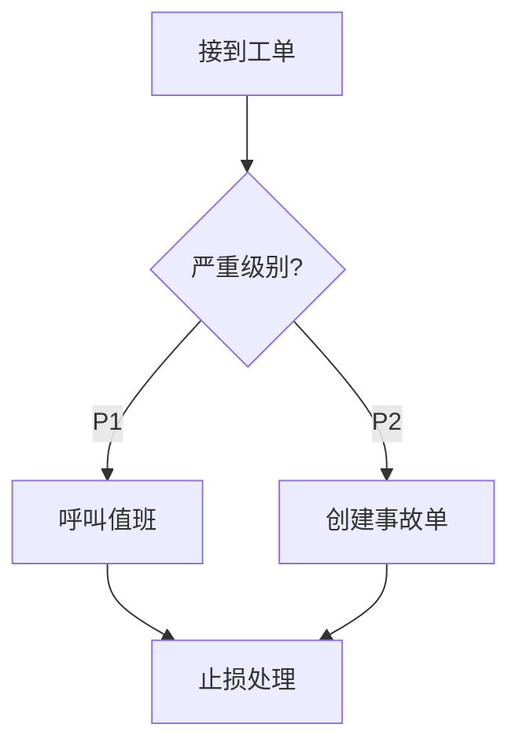
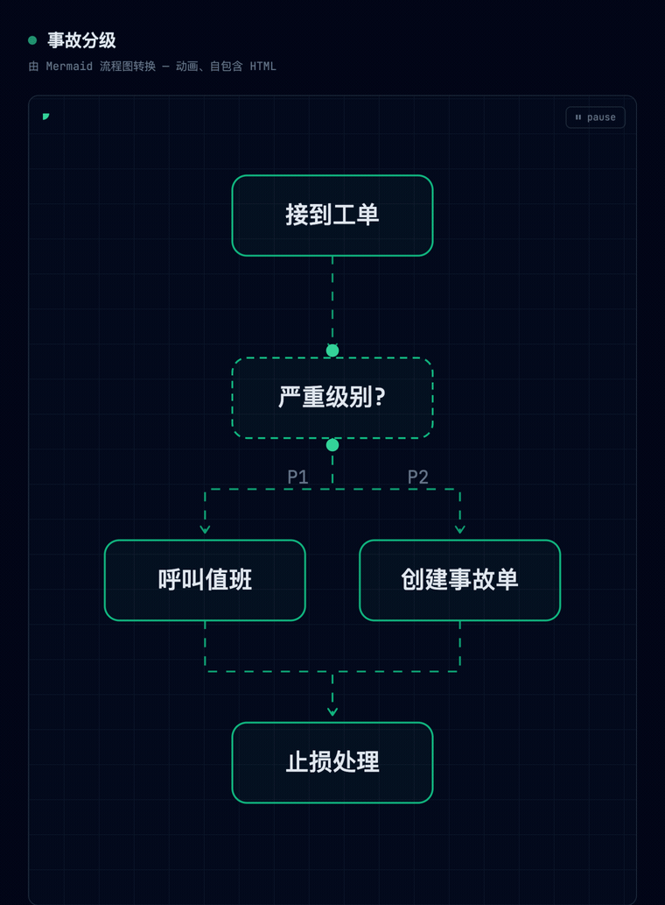

# Dashmotion

[English](README.md) | 简体中文

[](../../releases)
[](LICENSE)

**会流动的图。** 一个 Claude AI skill,把一段描述——纯文字**或** Mermaid 源码——变成带动画的技术图表:虚线沿执行方向流动、光点像真实请求一样在系统中穿行,输出为单个自包含的 HTML/SVG 文件。也就是现代基础设施产品官网(Diagrid、Temporal、Inngest)上那种动效。


**[▶ 在线看真实示例 →](https://csthink.github.io/dashmotion/)** —— 未经编辑的真实产物,不是视频。

两种模式 —— 用纯文字描述一段工作流或一个系统(或粘一段 Mermaid),得到一个打开即动的自包含 HTML 文件:

| Flow 模式 | Architecture 模式 |
|---|---|
|  |  |

## 它能做什么

描述一段工作流或一个系统——用纯文字,或粘一段 Mermaid——Claude 就返回一个打开即动的 `.html` 文件。项目名即实现:`stroke-dashoffset` offset 动画 + `animateMotion` 路径,零依赖库、不渲染 GIF、不需要设计工具。

- **输入(目前)**:一段自然语言描述,或一份 Mermaid `flowchart` / `graph` / `stateDiagram-v2` 源码——结果同样是动画图。
- **输出样式(目前)**:**Flow** —— 工作流、流水线、状态机,执行流从 START 经分支与汇合清晰地流向 END;**Architecture** —— 系统与拓扑,带语义化组件配色、region/安全边界、图例,以及差异化核心:**动画请求旅程**,一颗光点沿 客户端 → 网关 → 服务 → 数据库 逐跳穿行再返回。
- **用大白话微调**:*"把认证链路标出来"*、*"把 Redis 放到 Postgres 旁边"*、*"把两个 worker 拆成第二张图"*。
- **产物零依赖**:一个 HTML 文件——矢量、无限循环、几 KB、任何浏览器直接打开。

## 安装

需要带 skills 的 Claude 订阅(Pro、Max、Team 或 Enterprise)。

**Claude Code** — 一条命令。`-g` 装成全局(每个项目都能用);不加 `-g` 则只装进当前项目(`./.claude/skills/`):

```bash
npx skills add csthink/dashmotion -a claude-code -g
```

<details>
<summary>为什么带 <code>-a claude-code</code>,全局还是项目级?</summary>

- **`-a claude-code`** 写入一个普通*拷贝*(带 `-g` 进 `~/.claude/skills/`,不带则进 `./.claude/skills/`)。裸 `npx skills add csthink/dashmotion` 建的是*符号链接*,而 Claude Code 对符号链接支持很不稳——链接可能根本没建成、符号链接的 skill 不出现在 `/skills`([claude-code#14836](https://github.com/anthropics/claude-code/issues/14836))、`npx skills update` 也不刷新它。拷贝则能在 `/skills` 列出、也能干净更新。若 CLI 提示选拷贝还是符号链接,选**拷贝**(或加 `--copy`)。其他 agent(Cursor、Codex 等)直接读 `~/.agents/skills/`,裸命令没问题。
- **全局(`-g`)** 在 `~/.claude/skills/`,处处可用。**项目级**(不加 `-g`)在 `./.claude/skills/`——只在那一个目录生效,适合连同仓库一起提交、让团队都拿到这个 skill。

想在 Claude Code 上用 zip?`rm -rf ~/.claude/skills/dashmotion && unzip dashmotion.zip -d ~/.claude/skills/` —— 升级时先清空目录,避免旧文件残留。
</details>

**claude.ai** — 从 [Releases](../../releases) 下载 `dashmotion.zip`,然后 **Settings → Capabilities → Skills → + Add → 上传 → 开启**。

### 升级

没有任何 Claude 端会提示你 skill 出了新版——更新得自己拉。在 **Claude Code** 上,一条命令原地刷新:

```bash
npx skills update dashmotion -g -y
```

**带上 skill 名**:裸 `npx skills update -g -y` 会更新你**所有**全局 skill,不只是 dashmotion,可能顺带升级了你本不想动的别的 skill。项目级安装去掉 `-g`;重跑安装命令也行。**claude.ai** 没有原地更新——删掉旧 skill,重新上传新的 `dashmotion.zip`。

**查看当前装的是哪个版本** —— 版本号在 skill 的 `SKILL.md` 里,跟最新 [release](../../releases) 比一下就知道是否最新(`npx skills list` 只显示路径、不显示版本):

```bash
grep '^version:' ~/.claude/skills/dashmotion/SKILL.md     # 项目级:./.claude/skills/dashmotion/SKILL.md
```

<details>
<summary>彻底省心:每次启动自动更新(Claude Code)</summary>

挂一个 `SessionStart` hook,让 Claude Code 每次启动时刷新这个 skill。写进 `~/.claude/settings.json`:

```json
{
  "hooks": {
    "SessionStart": [
      { "matcher": "startup", "hooks": [
        { "type": "command", "command": "npx skills update dashmotion -g -y >/dev/null 2>&1 || true" }
      ] }
    ]
  }
}
```

代价是启动时多一次短网络请求,好处是悄悄帮你停在最新 tag。把命令换成 `npx skills update -g -y` 可自动更新你**所有**全局 skill。
</details>

**卸载:**

```bash
npx skills remove dashmotion -g         # 用 skills CLI 装的(项目级去掉 -g)
rm -rf ~/.claude/skills/dashmotion      # 手动解压装的(项目级用 ./.claude/...)
```

## 快速开始

装好之后,直接问——一句话就能看到效果:

```
用 dashmotion 画一个简单的三步登录流程。
```

下面两个更长的 prompt 是顶部两个 demo 用的——粘给 Claude 就能复现:

**Flow 模式** —— 上方左边那个 demo:

```
用 dashmotion 画我们的 CI/CD 流水线:一次提交并行运行 lint、单元测试、集成测试;三者汇合后构建 Docker 镜像;接着做安全扫描;然后部署到 staging;再经过人工审批门——通过则部署到生产并发送 Slack 通知,拒绝则通知作者并结束。
```

**Architecture 模式** —— 上方右边那个 demo:

```
用 dashmotion 画我们的 Kubernetes 微服务平台,并让主请求路径动起来:前端是 NGINX ingress;'shop' 命名空间里有 users、catalog、cart、payments 四个服务;服务与两个异步 worker(email、analytics)之间架一条 Kafka 总线;PostgreSQL 存订单,MongoDB 存 catalog;observability 命名空间里有 Prometheus 和 Grafana。动画演示一个 checkout 请求从 ingress 经 cart、payments 到 PostgreSQL,以及 payments 经 Kafka 到 email worker 的异步事件。
```

**几点值得知道的:**

- 每次生成布局都略有不同——你的图不会和上方 demo 像素级一致,但还是同一张图。
- 真实项目里不用把细节都写全:可以指向一份设计文稿(*"用 dashmotion 画 `docs/design.md` 里的架构"*),也可以直接让它画你正在做的东西的流程图 / 架构图。
- 手头已经有 Mermaid?直接粘过来——见下方 [Mermaid 输入](#mermaid-输入)。
- 对结果不满意?用大白话说就行,它会据此微调。

## Mermaid 输入

手头已经有 Mermaid 图?直接粘过来——dashmotion 把静态的 `flowchart`/`graph` 或 `stateDiagram-v2` 源码变成同款**会动**的图,不用重画。拓扑和标签原样保留,只重算布局与配色:

````
用 dashmotion 把这段 mermaid 变成动画:


````

……就变成一张会动的流程图——虚线连接器从 `接到工单` 流向 `严重级别?` 决策、扇出、再汇入 `止损处理`,光点沿路径行进:



转换契约:

- **原样保留**:每个节点与标签、每条边与边标签、subgraph 包含关系、边的种类——`-->` 流动,`-.->` 转为异步点线,`==>` 标记主路径并获得行进光点。
- **按设计重算**:布局(一律自上而下重排——`LR` 源会被重新布局;保结构、不保几何)与配色(`classDef`/`style`/`linkStyle` 由 dashmotion 的语义配色接管)。
- subgraph 表达系统组件(namespace、VPC、分层)时路由到 architecture 模式,带边界和请求旅程;普通流程分组留在 flow 模式。
- 其他 mermaid 图类型(sequence、class、ER、gantt)不支持——dashmotion 会明说,不做有损的瞎猜转换。

## 为什么不直接用 GIF?

| | GIF | Dashmotion (SVG/CSS) |
|---|---|---|
| 文件体积 | 数 MB | 数十 KB |
| 清晰度 | 固定分辨率 | 矢量,无限缩放 |
| 可编辑性 | 全部重新渲染 | 让 Claude 改一个框即可 |
| 无缝循环 | 逐帧对齐的苦活 | 天然免费 |
| 之后转 GIF | — | 一条命令(`timecut`)或直接录屏 |

## 可访问性

所有 CSS 动画包裹在 `@media (prefers-reduced-motion: no-preference)` 中;系统开启"减弱动态效果"时,SMIL 光点由脚本移除;每张图自带可见的暂停/播放按钮,以及 `role="img"` + `<title>`/`<desc>`。

## 常见问题

**可以和 [architecture-diagram-generator](https://github.com/Cocoon-AI/architecture-diagram-generator) 同时安装吗?**
可以——已实测共存。带动画意图的请求("让请求路径动起来")路由到 dashmotion;纯静态架构图请求仍由 Cocoon 的 skill 处理。无文件冲突。

## 实现原理与更多

动画技术、确定性布局引擎、仓库结构,以及导出 GIF/MP4,都在 **[docs/how-it-works.zh-CN.md](docs/how-it-works.zh-CN.md)**。版本历史见 **[CHANGELOG.md](CHANGELOG.md)**。

## 致谢

Skill 打包模式与静态架构设计体系基于 [Cocoon-AI/architecture-diagram-generator](https://github.com/Cocoon-AI/architecture-diagram-generator)(MIT)。视觉风格灵感来自 [diagrid.io](https://www.diagrid.io/catalyst) 的工作流动画。

## 协议

MIT
